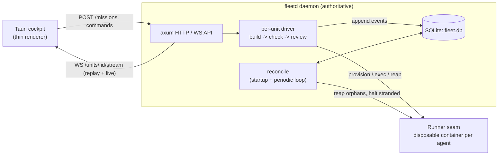

# Command Center

**A Rust control plane that runs coding agents in disposable containers and holds the authoritative state of the fleet.** You dispatch a task; the daemon provisions an isolated agent, drives it through a build → check → review lifecycle under hard cost and time budgets, opens a verified-mergeable PR, and streams every state change to a thin desktop cockpit — surviving crashes and restarts because all state lives in SQLite, not memory.

[](LICENSE)
[](crates/)
[](cockpit/ui/)

> **Status:** the control plane and workflow layer are feature-complete and tested
> (116 workspace tests). The product shell around it — plugin embedding, a design
> pass, remote control — is on the [roadmap](#status). See [honest status](#status).

---

## Why this exists

Running autonomous coding agents well is a *systems* problem, not a prompting problem.
An agent that edits code is the easy part; the hard part is everything around it —
isolating it so it can't wreck your machine, capping what it can spend, retrying
through rate limits, keeping authoritative state when a process dies mid-run, and
giving an operator one place to watch and steer the whole fleet. Command Center is
that surrounding machine: a small, durable daemon that treats each agent run as a
supervised, budgeted, resumable unit of work.

## Architecture

Two Rust crates behind a thin desktop UI:

- **`fleet-core`** — the pure domain: the unit lifecycle state machine (`Phase`),
  tier/gate policy (the human-in-the-loop "autonomy ladder"), and the events and
  commands that move a unit between phases. No I/O — exhaustively unit-tested.
- **`fleetd`** — the daemon: an [axum](https://github.com/tokio-rs/axum) HTTP/WS
  server, a per-unit async **driver**, the container **Runner** seam, retry/budget
  logic, and the SQLite **store**.
- **`cockpit/`** — a [Tauri](https://tauri.app) + Svelte desktop app ("Fleet
  Command") that bundles `fleetd` as a sidecar and renders fleet state live.



The parts worth a closer look:

### Authoritative state + a reconcile loop
The daemon — not the UI, not the container — is the source of truth. Every unit's
phase and full event log is persisted to SQLite as it happens. Because the world
(running containers) can drift from that truth, `fleetd` reconciles the two in two
places ([`crates/fleetd/src/reconcile.rs`](crates/fleetd/src/reconcile.rs)):

- **On startup**, before accepting connections: reap orphan containers left by a
  crash and mark stranded units `halted` so they can be resumed.
- **On a periodic loop** (`CC_RECONCILE_SECS`, default 30s): the same convergence,
  continuously — but crucially it *spares any unit that still has a live driver*, so
  steady-state reconciliation reaps genuine orphans without ever disturbing in-flight
  work. (`reconcile_live` / `reconcile_tick`.)

### State streaming over WebSocket
Renderers are thin: they hold no authoritative state, they *subscribe* to it. A
client connects to `GET /units/:id/stream?since=<seq>`; the server **replays** the
persisted history from that sequence, then **tails** live events over the same socket
([`server.rs`](crates/fleetd/src/server.rs)). Reload the cockpit and it rebuilds from
`since=0`; nothing is lost. Covered end-to-end by an integration test that drives a
real WebSocket client against the running server.

### Durable recovery across restarts
Kill the daemon at any point and restart it: because state is in SQLite and the
driver is event-sourced, the new process reconstructs every unit from disk. A resumed
real unit reuses its kept container volume and skips the already-frozen test oracle;
a stranded unit is halted by startup reconciliation and can be `resume`d.

Prove it yourself — no Docker or API key needed:

```bash
cargo build -p fleetd --bin serve
node scripts/demo-restart-recovery.mjs
```

```
daemon #1 up
dispatched demo unit u1
  before kill:   phase=done  events=26
daemon #1 killed (SIGKILL)
daemon #2 up (same SQLite db, cold memory)
  after restart: phase=done  events=26

PASS — 26-event history for u1 survived a hard restart, restored from demo-restart.db by a cold process.
```

### Budgets, retries, and rate limits
An agent run is bounded on every axis
([`retry.rs`](crates/fleetd/src/retry.rs), [`driver.rs`](crates/fleetd/src/driver.rs)):

- **USD budget** — a hard per-unit cap, plus a rolling-24h **global** spend ceiling
  (`CC_GLOBAL_USD_CAP`) that refuses new missions with `429` once hit.
- **Wall-clock cap** — a backstop against an agent that loops or stalls and burns
  money without tripping the cost cap between steps.
- **Rate-limit handling** — on an Anthropic throttle the driver accounts the attempt,
  emits a "rate limited" event, waits out an **exponential backoff with a cap**, and
  re-execs; after ~1h of accumulated throttle time it parks the unit at `NeedsHuman`
  rather than spinning.

### Isolation
Everything container-specific lives behind the `Runner` trait
([`runner.rs`](crates/fleetd/src/runner.rs)). `LocalDockerRunner` launches each agent
in a disposable `cc-agent` container (network open, filesystem and secrets isolated);
`FakeRunner` replays scripted output so the entire lifecycle is testable without
Docker, git, or a real model.

## Quickstart

**Fastest path to "it works" — a `$0` demo mission, no Docker or API key:**

```bash
# 1. Build the workspace
cargo build --release

# 2. Run the daemon (binds 127.0.0.1:8787, persists to ./fleet.db)
./target/release/serve            # Windows: .\target\release\serve.exe

# 3. Dispatch a demo mission (scripted agent, metered $0, no container)
curl -s -X POST http://127.0.0.1:8787/missions \
  -H 'content-type: application/json' \
  -d '{"task":"add a sum() helper with tests","tier":"t1","mode":"demo","min_review_rounds":1}'
# → {"unit_id":"u1"}

# 4. Watch it walk its phases
curl -s http://127.0.0.1:8787/units/u1
```

For the desktop cockpit, a real (Docker + `ANTHROPIC_API_KEY`) mission, resuming a
halted unit, and troubleshooting, see the **[full quickstart](docs/quickstart.md)** —
every command in it is cross-checked against the code. Run the tests with:

```bash
cargo test --workspace     # 116 tests; Docker/network ITs are #[ignore]d
```

## Repository layout

| Path | What |
|---|---|
| [`crates/fleet-core`](crates/fleet-core) | Pure domain: lifecycle state machine, tiers, gates, events |
| [`crates/fleetd`](crates/fleetd) | The daemon: HTTP/WS server, driver, Runner seam, retry/budget, SQLite store |
| [`cockpit/ui`](cockpit/ui) | Tauri + Svelte desktop cockpit ("Fleet Command") |
| [`deploy/agent-image`](deploy) | The `cc-agent` container image the real runner launches |
| [`scripts/`](scripts) | Runnable demos (e.g. restart recovery) |
| [`docs/`](docs) | Quickstart, architecture vision, roadmap |

### Repo hooks

One-time, per clone:

```bash
git config core.hooksPath .githooks
```

This enables the embargo guard ([`scripts/embargo-guard.mjs`](scripts/embargo-guard.mjs)), which
blocks commits whose staged content or commit message contains a forbidden token. It matches against
salted digests in `.embargo-guard.json` rather than plaintext, so neither the guard nor its config
names what it screens for. The same check runs as the `embargo` job in CI, so skipping the hook —
or committing with `--no-verify` — does not skip the check.

## Status

**Feature-complete and tested:**

- ✅ Rust control plane — daemon, per-unit driver, unit lifecycle state machine
- ✅ Authoritative state + startup **and** periodic reconciliation
- ✅ WebSocket state streaming (replay + live) to thin renderers
- ✅ Durable recovery across restarts (SQLite-backed, event-sourced)
- ✅ Retry/backoff, rate-limit handling, per-unit + global budget rules
- ✅ Container isolation via the `Runner` seam; demo mode with no Docker/key
- ✅ Tauri desktop cockpit; cross-platform CI (workspace tests + 3-OS Tauri bundles)

**On the roadmap** (tracked in [`docs/ROADMAP.md`](docs/ROADMAP.md)) — the "one-stop
shop for agentic engineering" vision beyond the core control plane:

- ⏳ Hosting other tools *inside* the cockpit (app-/view-plugin embedding)
- ⏳ Turning the project board from a viewer into a dispatch surface
- ⏳ A visual design pass on the cockpit
- ⏳ Remote control (drive the fleet from away-from-desk)

Signed release bundles are wired in CI ([`release.yml`](.github/workflows/release.yml))
and gate on code-signing certificates; no tagged release exists yet.

## License

MIT — see [LICENSE](LICENSE).
